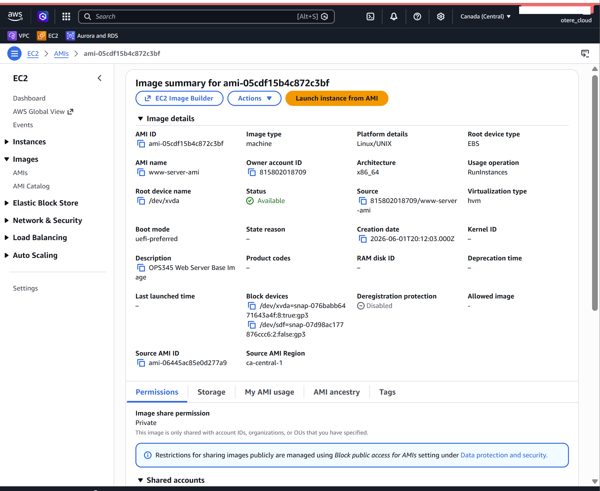
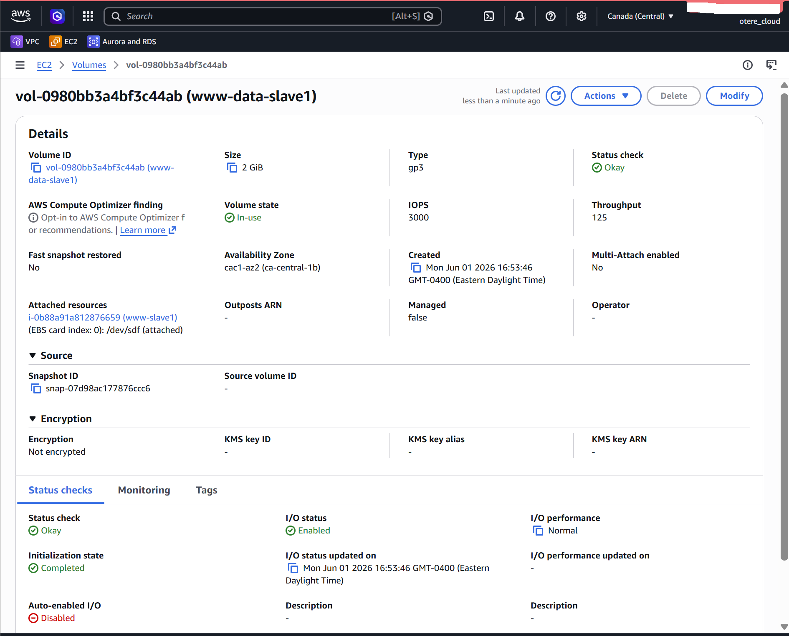
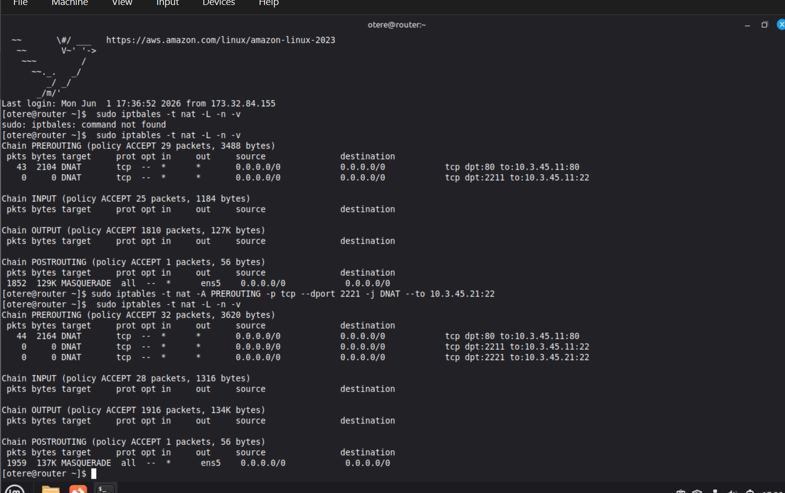
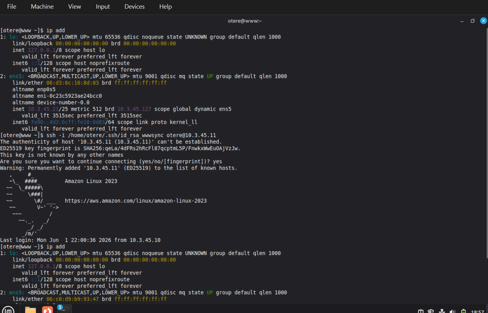
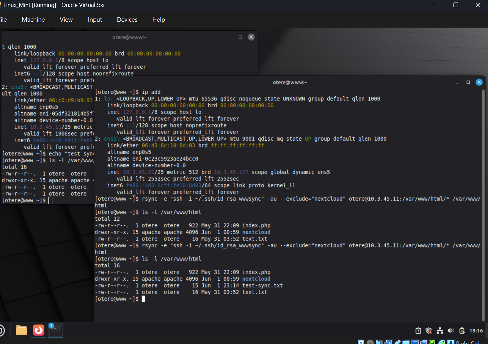
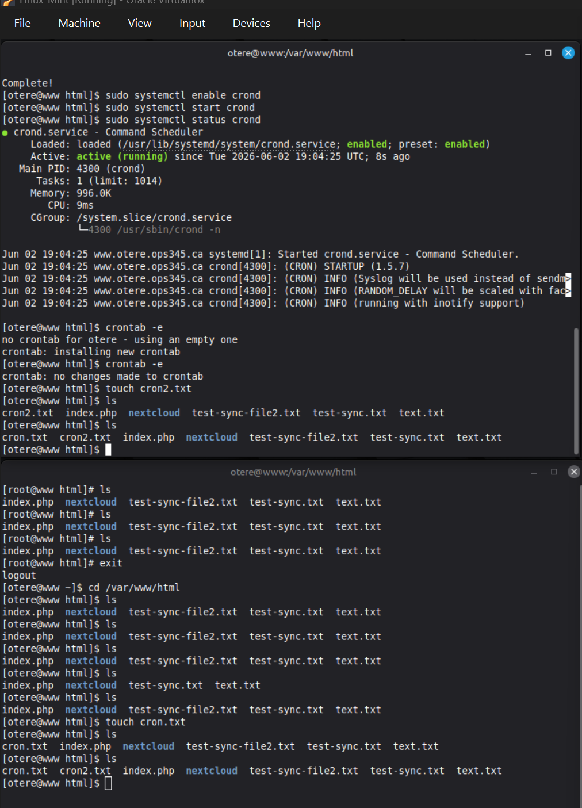
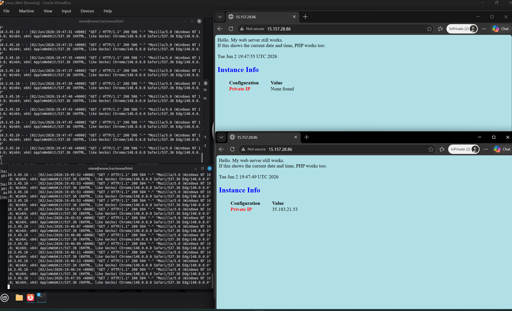
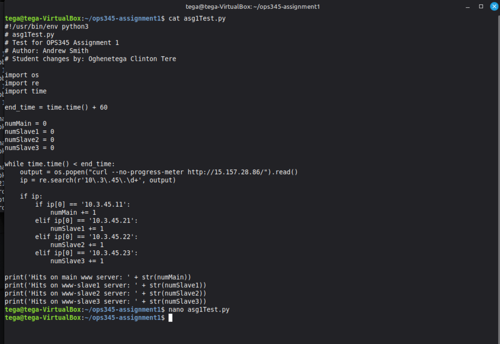

# Assignment 1 — Web Server Load Balancing

## Overview

This project implements a highly available web-server environment in AWS using multiple EC2 instances, automated file synchronization, Linux networking, and iptables-based load balancing.

The environment consists of a router/load balancer and four web servers:

- `www` — 10.3.45.11
- `www-slave1` — 10.3.45.21
- `www-slave2` — 10.3.45.22
- `www-slave3` — 10.3.45.23

Incoming HTTP requests are distributed across the four web servers using iptables DNAT and the statistic module.

---

## Technologies Used

- AWS EC2
- Amazon Machine Images (AMI)
- Amazon EBS
- Amazon Linux 2023
- Apache HTTP Server
- PHP
- Linux iptables
- SSH key authentication
- rsync
- cron / crond
- Python 3
- curl
- Linux networking

---

## Architecture

```text
                    Internet
                       |
                       |
                Public IP / HTTP
                       |
                       v
              +----------------+
              |     Router     |
              |    iptables    |
              | Load Balancer  |
              +-------+--------+
                      |
        +-------------+-------------+-------------+
        |             |             |             |
        v             v             v             v
   +---------+   +---------+   +---------+   +---------+
   |   www   |   | slave1  |   | slave2  |   | slave3  |
   | .45.11  |   | .45.21  |   | .45.22  |   | .45.23  |
   +---------+   +---------+   +---------+   +---------+
        \             |             |             /
         \____________|_____________|____________/
                      |
              Synchronized Web
                   Content
```

---

## 1. Web Server Images and Storage

Amazon Machine Images were used to create consistent copies of the web-server configuration.

Additional EBS storage was also used for the web-server environment.





---

## 2. Router and NAT Configuration

A dedicated router instance was configured using Linux `iptables`.

DNAT rules forward incoming connections from the router to the appropriate internal web servers.

The router was also used to provide SSH port forwarding to servers that did not require their own public IP addresses.



---

## 3. SSH Key Authentication

A dedicated SSH key was configured to allow secure communication between the web servers.

This allowed `rsync` to transfer files between servers without requiring interactive password authentication.



---

## 4. Web Content Synchronization with rsync

`rsync` was used to synchronize the contents of `/var/www/html` between the main web server and the slave server.

The Nextcloud directory was excluded from synchronization.

Example:

```bash
rsync -e "ssh -i ~/.ssh/id_rsa_wwwsync" \
-au --exclude="nextcloud" \
/var/www/html/* user@SERVER:/var/www/html
```

Synchronization was tested by creating files on the servers and verifying that they appeared on the other web server.



---

## 5. Automated Synchronization with Cron

After manual synchronization was verified, the process was automated using cron.

The synchronization jobs run every five minutes, allowing changes in the web directory to be propagated automatically.

Example schedule:

```cron
*/5 * * * * rsync ...
```

The `crond` service was enabled and configured to start automatically.



---

## 6. Four-Server Load Balancing

The environment was expanded to four web servers.

iptables DNAT rules using the `statistic` module were configured on the router to distribute HTTP traffic among:

```text
10.3.45.11
10.3.45.21
10.3.45.22
10.3.45.23
```

The probability rules were arranged so that the overall traffic distribution was approximately equal across all four servers.

---

## 7. Load Balancer Testing

HTTP requests were sent repeatedly to the router's public endpoint.

The web-server access logs and web page output were monitored to confirm that different backend servers processed incoming requests.



---

## 8. Automated Python Load Test

A Python script was created to automate load testing.

The script:

1. Sends repeated HTTP requests using `curl`.
2. Reads the private IP returned by the web page.
3. Determines which backend server processed the request.
4. Counts requests handled by each server.
5. Runs the test for 60 seconds.
6. Displays the resulting request distribution.

The script is available here:

[`scripts/asg1Test.py`](scripts/asg1Test.py)



---

## Key Skills Demonstrated

This project demonstrates practical experience with:

- Deploying and cloning Linux EC2 instances
- Creating and managing AMIs
- Working with EBS storage
- Configuring Linux routing and NAT
- Implementing iptables DNAT rules
- Configuring SSH key-based authentication
- Synchronizing application files with rsync
- Automating Linux tasks with cron
- Building a multi-server web architecture
- Implementing basic load-balancing logic
- Testing infrastructure with Python and curl
- Troubleshooting Linux networking and web-server connectivity

---

## Project Result

The completed environment provides four web servers behind a Linux-based iptables load balancer, with automated web-content synchronization and a Python-based method for validating traffic distribution.

This assignment provided hands-on experience with several concepts that are fundamental to cloud infrastructure, Linux administration, automation, and highly available web architectures.