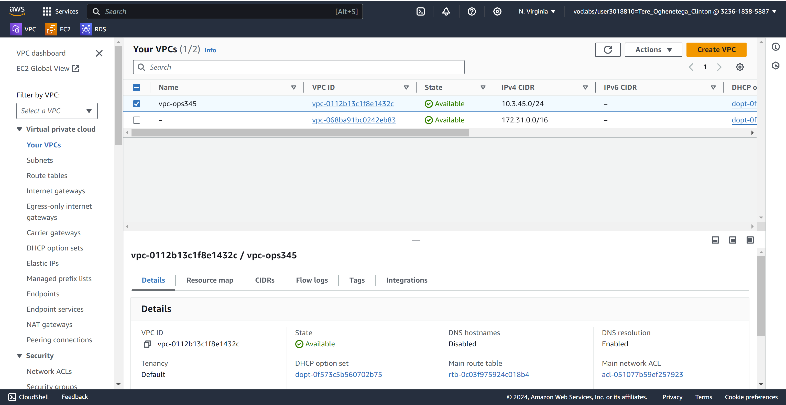
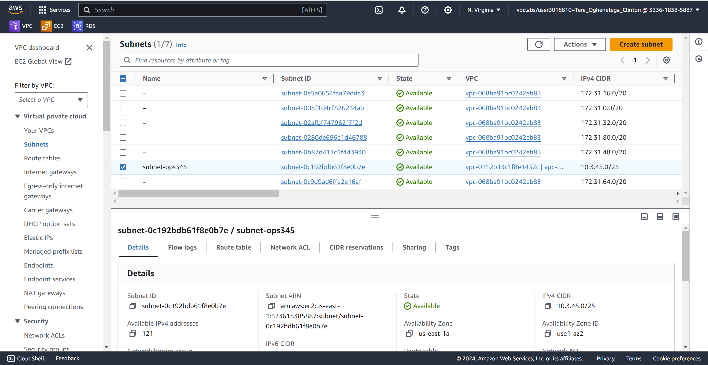
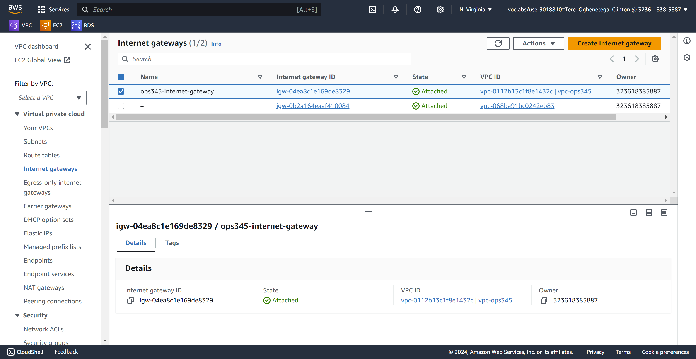
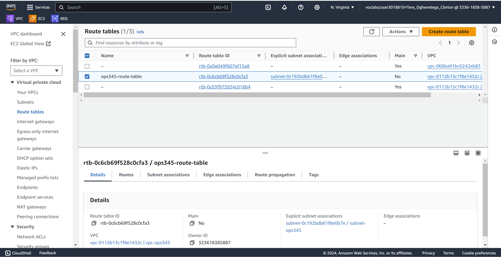
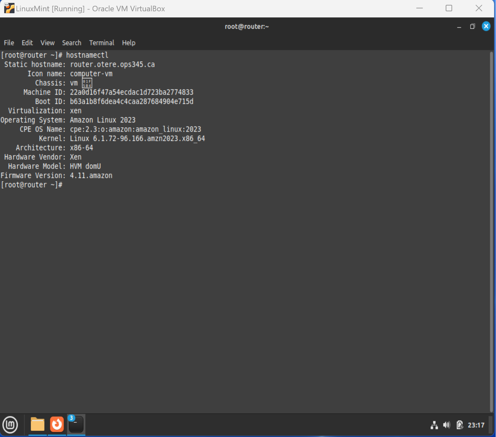
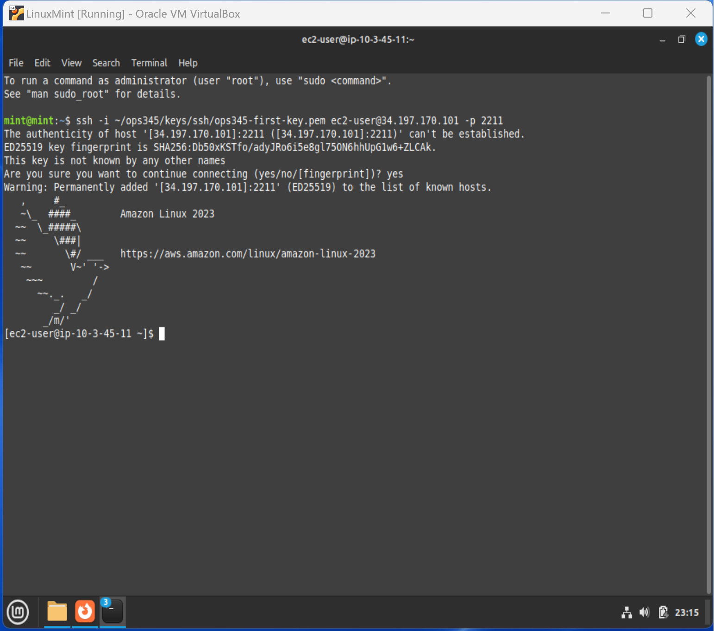

# Lab 2 – Network Infrastructure

## Objective

The goal of Lab 2 was to design and deploy a custom AWS network infrastructure that would host multiple EC2 instances and provide secure access to internal services.

This lab introduced core cloud networking concepts including VPCs, subnets, route tables, internet gateways, NAT, and port forwarding.

---

## Technologies Used

- Amazon Web Services (AWS)
- Amazon VPC
- Amazon EC2
- Amazon Linux 2023
- Route Tables
- Internet Gateway
- Security Groups
- iptables
- SSH

---

## Network Design

### VPC

Created a custom Virtual Private Cloud (VPC):

```text
10.3.45.0/24
```

### Public Subnet

Created a subnet:

```text
10.3.45.0/25
```

### Instances

| Hostname | Private IP |
|-----------|-----------|
| router | 10.3.45.10 |
| www | 10.3.45.11 |

---

## Tasks Completed

### 1. Create VPC

Created a dedicated VPC to isolate the OPS345 environment from other AWS resources.

### 2. Create Public Subnet

Created a subnet to host the router and web server instances.

### 3. Configure Internet Gateway

Created and attached an Internet Gateway to the VPC.

This allowed resources inside the VPC to communicate with the Internet.

### 4. Configure Route Table

Created a custom route table and associated it with the subnet.

Configured:

```text
0.0.0.0/0
```

to route traffic through the Internet Gateway.

### 5. Launch Router Instance

Configured the router instance with:

```text
10.3.45.10
```

The router serves as the entry point into the private network.

### 6. Launch Web Server Instance

Configured the web server with:

```text
10.3.45.11
```

The web server does not have a public IP address and can only be accessed through the router.

### 7. Configure NAT

Enabled IP forwarding and NAT on the router using iptables.

Example:

```bash
iptables -t nat -L -n
```

### 8. Configure Port Forwarding

Configured SSH forwarding:

```text
Router Port 2211 → Web Server Port 22
```

This allows secure SSH access to the internal web server.

### 9. Verify SSH Connectivity

Successfully connected to the internal web server through the router using:

```bash
ssh -i key.pem ec2-user@<router-public-ip> -p 2211
```

---

## Skills Learned

- AWS Networking
- VPC Design
- Subnet Design
- Internet Gateway Configuration
- Route Table Configuration
- Linux Routing
- NAT Configuration
- Port Forwarding
- Secure Remote Access
- Network Troubleshooting

---

## Verification Screenshots

### VPC Configuration



### Subnet Configuration



### Internet Gateway



### Route Table



### Router Instance



### NAT Configuration


### SSH Through Router



---

## Outcome

Successfully built a secure AWS network environment consisting of a custom VPC, subnet, routing infrastructure, and internal web server accessible through a dedicated router using NAT and port forwarding.