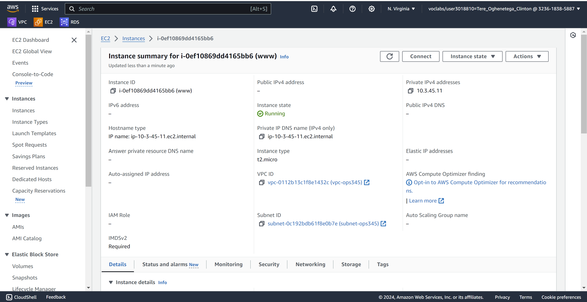
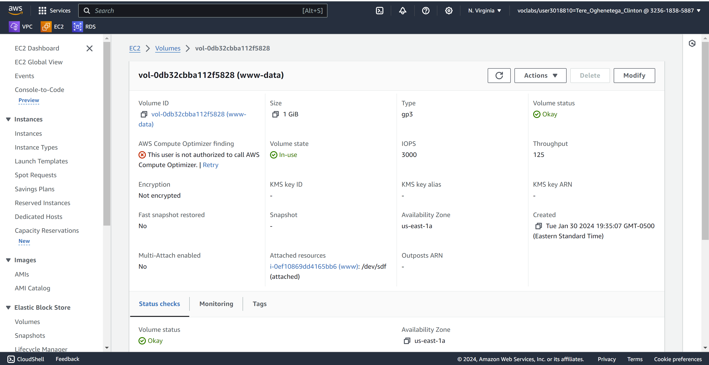
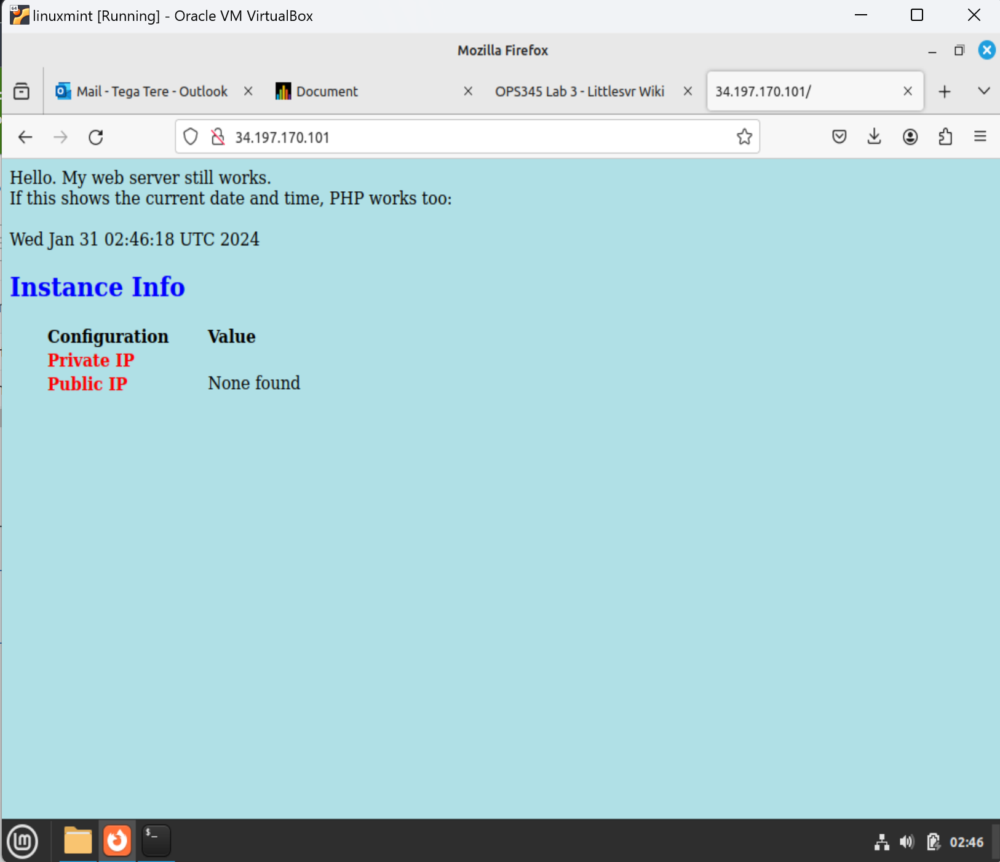

# Lab 3 – Persistent Storage and Web Server Recovery

## Objective

The goal of Lab 3 was to deploy a web server using persistent storage and demonstrate disaster recovery by rebuilding a server while preserving website data.

This lab introduced EBS volumes, LVM, filesystems, Apache, PHP, and storage recovery concepts.

---

## Technologies Used

- Amazon Web Services (AWS)
- Amazon EC2
- Amazon EBS
- Amazon Linux 2023
- Apache (httpd)
- PHP
- LVM
- ext4 Filesystem
- SSH

---

## Architecture

| Hostname | Private IP |
|-----------|-----------|
| router | 10.3.45.10 |
| www | 10.3.45.11 |

Storage:

```text
EBS Volume
    ↓
Physical Volume (PV)
    ↓
Volume Group (VG)
    ↓
Logical Volume (LV)
    ↓
ext4 Filesystem
    ↓
/var/www
```

---

## Tasks Completed

### 1. Create Persistent EBS Storage

Created an EBS volume:

```text
www-data
2 GiB
```

Attached to:

```text
www
```

Device:

```text
/dev/sdf
```

Purpose:

Store website data independently from the EC2 instance.

---

### 2. Configure LVM

Created:

#### Physical Volume

```bash
pvcreate
```

#### Volume Group

```bash
vgcreate vg_www
```

#### Logical Volume

```bash
lvcreate lv_www
```

Purpose:

Provide flexible storage management for website data.

---

### 3. Create Filesystem

Created:

```text
ext4
```

filesystem on:

```text
/dev/vg_www/lv_www
```

Purpose:

Allow Linux to store files on the logical volume.

---

### 4. Mount Persistent Storage

Mounted:

```text
/var/www
```

Configured automatic mounting using:

```text
/etc/fstab
```

Purpose:

Ensure website data remains available after reboots.

---

### 5. Install Apache

Installed:

```bash
httpd
```

Configured Apache to serve content from:

```text
/var/www/html
```

Purpose:

Host website content.

---

### 6. Install PHP

Installed:

```bash
php
```

Created:

```text
index.php
```

Purpose:

Provide dynamic web content.

---

### 7. Verify Website Operation

Verified:

```text
Date
Private IP
Public IP
```

displayed correctly through PHP.

---

## Disaster Recovery Exercise

### Original Server

```text
ww
```

Hosted website content stored on:

```text
www-data
```

EBS volume.

---

### Simulated Failure

Terminated:

```text
ww
```

while preserving:

```text
www-data
```

EBS volume.

Purpose:

Simulate server failure.

---

### Recovery

Created replacement server:

```text
www
```

Reattached:

```text
www-data
```

Recovered:

```text
PV
VG
LV
Filesystem
```

Mounted:

```text
/var/www
```

Restored:

```text
Apache
PHP
Website Content
```

---

### Verification

Verified:

- Website data survived
- Filesystem mounted successfully
- Apache served original content
- Data remained intact after reboot

---

## Skills Learned

- AWS EBS Administration
- Linux Storage Management
- LVM (PV, VG, LV)
- Filesystem Management
- Apache Administration
- PHP Configuration
- Disaster Recovery
- Persistent Storage Design
- Linux Troubleshooting

---

## Verification Screenshots

### Rebuilt WWW Server



### Persistent EBS Volume



### Recovered Website



---

## Outcome

Successfully implemented persistent storage using AWS EBS and LVM, deployed a functional Apache/PHP web server, and demonstrated disaster recovery by rebuilding a server while preserving all website data.