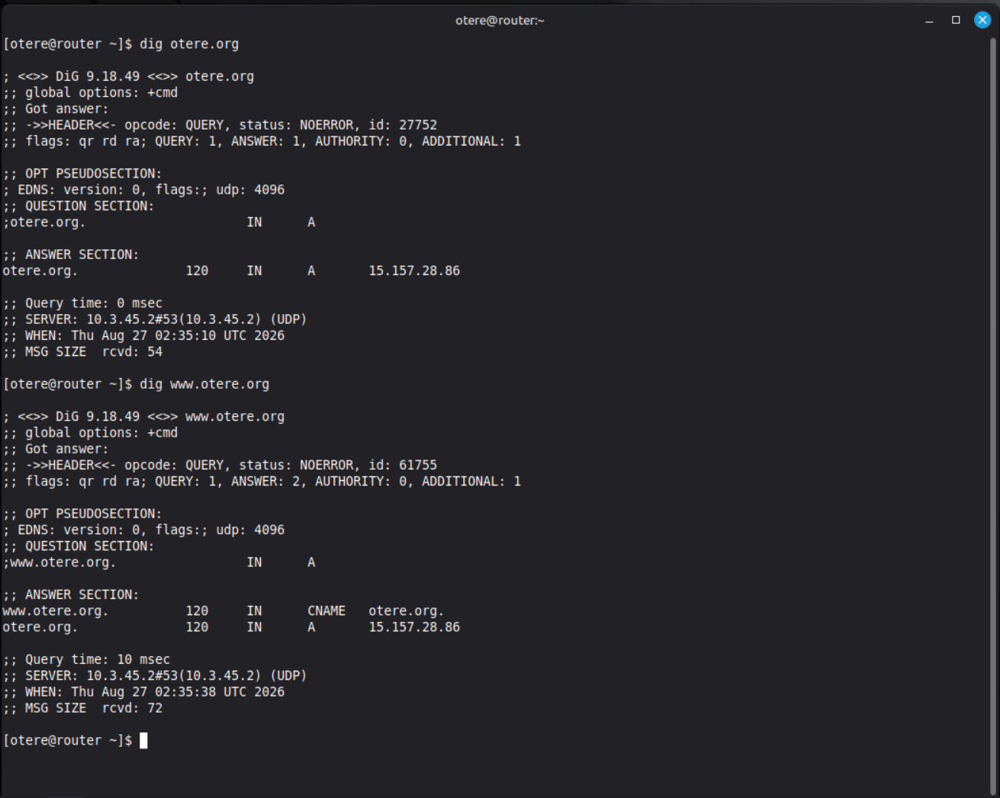
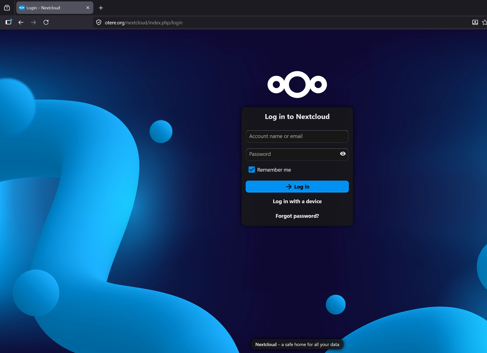

# Lab 5 – DNS Configuration with Amazon Route 53

## Objective

The objective of this lab was to configure public DNS records and access the Nextcloud application using a Fully Qualified Domain Name (FQDN) instead of an IP address.

For this implementation, I used my registered domain:

`otere.org`

The DNS zone is managed using Amazon Route 53.

---

## Architecture

```text
User Browser
     |
     v
www.otere.org
     |
     v
Amazon Route 53 DNS
     |
     v
A Record -> Router Elastic IP
     |
     v
Router EC2
     |
     v
Web Server
     |
     v
Nextcloud
```

---

## DNS Records Configured

### A Record

An A record was configured to map the root domain to the Elastic IP address assigned to the router EC2 instance.

```text
otere.org -> Router Elastic IP
```

This allows clients to locate the server using the domain name instead of its IP address.

### CNAME Record

A CNAME record was configured for the `www` hostname:

```text
www.otere.org -> otere.org
```

The CNAME acts as an alias, allowing `www.otere.org` to resolve through the root domain.

---

## DNS Verification

The `dig` command was used to verify that the DNS records were resolving correctly.

### Verify the A Record

```bash
dig otere.org
```

This verifies that `otere.org` resolves to the router's Elastic IP address.

### Verify the CNAME Record

```bash
dig www.otere.org
```

This verifies that `www.otere.org` is configured as an alias for `otere.org`.

### DNS Verification Evidence



---

## Nextcloud Access Using FQDN

After configuring and verifying DNS, Nextcloud was accessed through the fully qualified domain name:

```text
http://www.otere.org/nextcloud/
```

This confirmed that DNS resolution successfully directed requests to the AWS infrastructure hosting the Nextcloud application.

### Nextcloud Evidence



---

## Commands Learned in Lab 5

### `ping`

```bash
ping otere.org
```

Performs DNS resolution before attempting to send ICMP packets to the destination.

### `host`

```bash
host otere.org
```

Performs a DNS lookup and displays information associated with the domain.

### `host -a`

```bash
host -a otere.org
```

Displays more detailed DNS information.

### `dig`

```bash
dig otere.org
```

Queries DNS and displays detailed information about the returned records.

### Query a Specific DNS Record Type

```bash
dig otere.org MX
```

Queries specifically for the domain's MX (Mail Exchange) records.

### Query a Specific DNS Server

```bash
dig otere.org @8.8.8.8
```

Queries Google's public DNS server directly instead of using the system's default DNS resolver.

### Short DNS Output

```bash
dig otere.org +short
```

Returns only the DNS answer, making it useful for quickly checking DNS resolution.

---

## Key Concepts Learned

* **DNS (Domain Name System):** Translates human-readable domain names into IP addresses.
* **FQDN (Fully Qualified Domain Name):** The complete hostname and domain, such as `www.otere.org`.
* **A Record:** Maps a hostname to an IPv4 address.
* **CNAME Record:** Creates an alias from one hostname to another hostname.
* **MX Record:** Identifies mail servers responsible for receiving email for a domain.
* **TXT Record:** Stores text-based information commonly used for domain verification and security mechanisms.
* **TTL (Time To Live):** Determines how long a DNS response may be cached.
* **DNS Caching:** Reduces repeated DNS queries by temporarily storing previous responses.
* **Authoritative DNS Server:** Holds the official DNS records for a domain.
* **DNS Propagation:** Refers to DNS changes becoming visible through DNS resolvers as cached records expire.

---

## Result

Successfully configured and verified public DNS for `otere.org` using Amazon Route 53. The A and CNAME records resolved correctly, and the Nextcloud application was successfully accessed using `www.otere.org/nextcloud/` rather than directly through an IP address.
