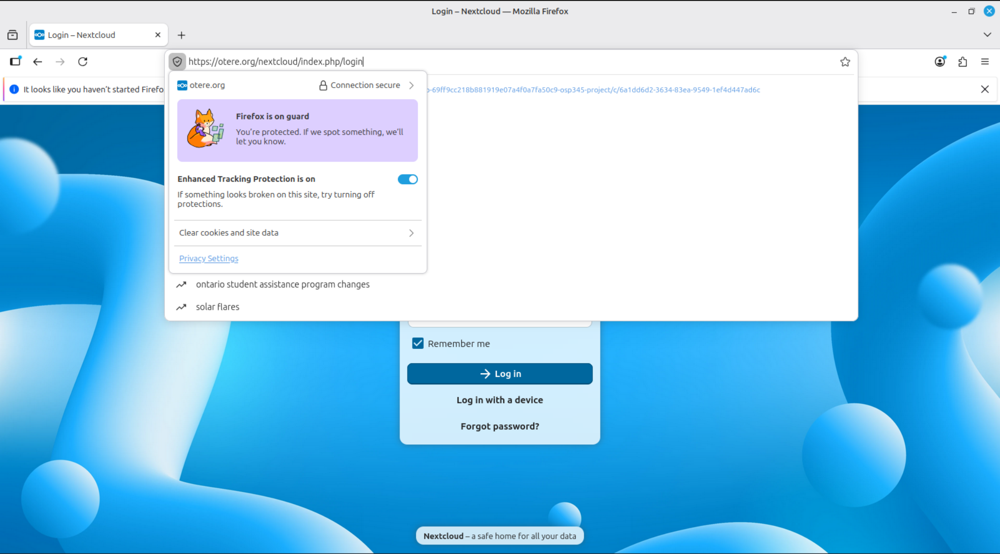

# OPS345 Lab 6 – HTTPS and SSL/TLS Certificates

## Overview

In this lab, I configured HTTPS for an Apache web server using a trusted SSL/TLS certificate issued by Let's Encrypt.

The existing OPS345 environment consisted of a router EC2 instance and a private WWW EC2 instance running Apache and Nextcloud. HTTPS traffic was configured to enter through the router on TCP port 443 and be forwarded to the WWW server.

I also configured an HTTP-to-HTTPS redirect so users accessing the site over HTTP are automatically redirected to the secure HTTPS version.

## Technologies Used

* AWS EC2
* Amazon Linux 2023
* Apache HTTP Server
* Let's Encrypt
* Certbot
* SSL/TLS
* Route 53 DNS
* Linux iptables
* AWS Security Groups
* Nextcloud

## Certificate Creation

Certbot was used to request a certificate from Let's Encrypt using DNS validation.

```bash
sudo certbot certonly --manual --preferred-challenges dns
```

Let's Encrypt required a temporary TXT record under:

```text
_acme-challenge.otere.org
```

The DNS record was verified using:

```bash
dig _acme-challenge.otere.org TXT
```

After successful validation, Let's Encrypt issued the certificate and private key.

## Certificate Files

A directory was created to store copies of the certificate files:

```bash
mkdir -p ~/ops345/keys/certbot
```

The certificate and private key were copied into the directory and ownership was assigned to the regular user.

The files were then placed in the standard TLS locations used by Apache:

```text
/etc/pki/tls/certs/otere.org.cert.pem
/etc/pki/tls/private/otere.org.key.pem
```

## Apache HTTPS Configuration

Apache SSL support was installed using:

```bash
sudo dnf install mod_ssl -y
```

The Apache SSL configuration was updated to use the Let's Encrypt certificate:

```apache
SSLCertificateFile /etc/pki/tls/certs/otere.org.cert.pem
SSLCertificateKeyFile /etc/pki/tls/private/otere.org.key.pem
```

Apache was configured with:

```apache
ServerName otere.org
```

The configuration was validated before restarting Apache:

```bash
sudo apachectl configtest
```

Apache was then restarted:

```bash
sudo systemctl restart httpd
```

## HTTPS Networking

HTTPS uses TCP port 443.

The router was configured with an iptables DNAT rule to forward incoming TCP 443 traffic to the private WWW server.

The AWS Security Groups were also configured so that:

* The router accepts HTTPS traffic on TCP 443 from the Internet.
* The WWW server accepts HTTPS traffic from the router.

The iptables configuration was saved so the forwarding rules survive a router reboot.

## Troubleshooting

During testing, Apache was confirmed to be listening on TCP port 443:

```bash
sudo ss -tulpn | grep :443
```

HTTPS connectivity from the router to the WWW server was tested using:

```bash
curl -k https://<WWW_PRIVATE_IP>
```

The router's NAT configuration was inspected using:

```bash
sudo iptables -t nat -L PREROUTING -n -v
```

HTTPS traffic was also monitored using:

```bash
sudo tcpdump -nni any port 443
```

Apache and the internal HTTPS connection were working correctly, but HTTPS initially failed from an external browser. The issue was traced to the router's AWS Security Group, where inbound TCP port 443 had not been allowed.

After adding the HTTPS inbound rule to the router Security Group, external HTTPS access worked successfully.

## HTTP to HTTPS Redirect

Apache was additionally configured to automatically redirect HTTP traffic to HTTPS:

```apache
<VirtualHost *:80>
    ServerName otere.org
    Redirect permanent / https://otere.org/
</VirtualHost>
```

This means a request to:

```text
http://otere.org
```

is automatically redirected to the secure HTTPS site.

## Evidence

### Nextcloud over HTTPS

The following screenshot demonstrates Nextcloud successfully running over HTTPS using the trusted TLS certificate.



## Result

The web server now supports encrypted HTTPS communication using a trusted Let's Encrypt certificate. TCP 443 traffic is securely forwarded through the router to the private WWW server, and HTTP requests are automatically redirected to HTTPS.
